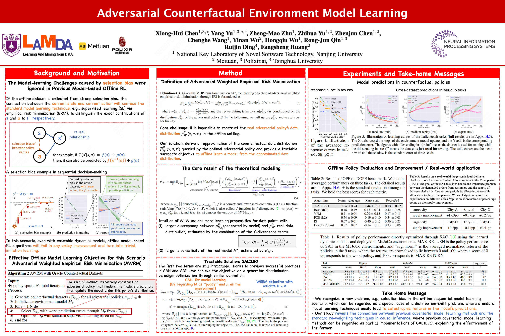

# GALILEO (NeurIPS'23 Spotlight)

The official code of "Adversarial Counterfactual Environment Model Learning". 

We provide a faithful offline dynamics model learning technique based on the adversarial model learning paradigm. 



The optimization pipeline of the proposed algorithm is as follows:


## quickstart

install
```
pip install -e .
pip install -r requirements.txt
```

install RLAssistant for experiment management

```
git clone https://github.com/polixir/RLAssistant.git
cd RLAssistant
pip install -e .
```

run

```
cd run_scripts
python main.py --data_type d4rl --env_name hopper --data_train_type medium
```

view your results

1. the tensorboard logs are in ./RLA_LOG/log folder;
2. you can manager your experiment result via RLAssistant (see: https://github.com/polixir/RLAssistant)
